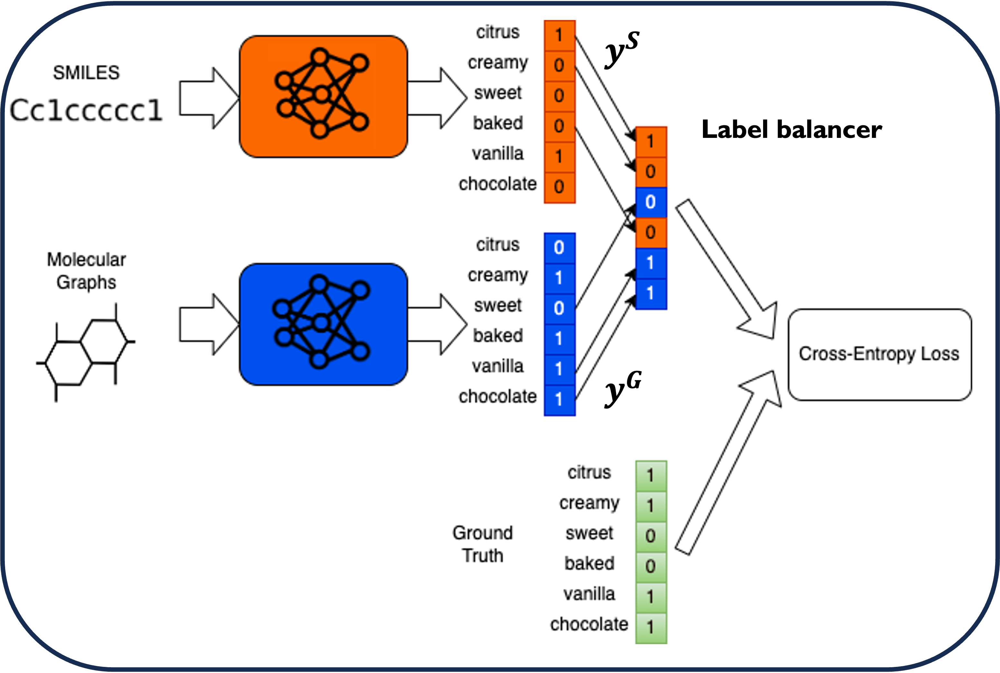

# AromaSense: Optimizing Learning Across Multimodal Transfer Features for Modeling Olfactory Perception

Daniel Shin\*, Gao Pei\*, Priyadarshini Kumari, Tarek Besold

## Overview

Official codebase for AromaSense: Optimizing Learning Across Multimodal Transfer Features for Modeling Olfactory Perception
Contains scripts to reproduce experiments.



## Installation

Dependencies can be installed with the following command:

```
conda env create -f environment.yml
```

## Example usage

Scripts to reproduce our results can be found in `run.sh`.

```
python main.py --config-name config_MULTI
```
